# Bullet Girls 2 New Game 岬守学園 RTA

## 用語

<dl>
<dt><dfn><abbr title="Scramble Overdrive">SOD</abbr></dfn></dt>
<dd>スクランブル・オーバードライブ。乙女の固有能力</dd>
</dl>

## タイマー

<dl>
<dt>タイマースタート</dt>
<dd>岬守学園を選択した瞬間</dd>
<dt>タイマーストップ</dt>
<dd>エリア10攻略後、学園のエンブレムが出現した瞬間</dd>
</dl>

## タイマースタート～エリア1
△長押しで会話を飛ばす。
余裕があればおっぱいをタッチする。

アイキャッチは〇で飛ばす。

## 1-A

### 出撃

* 月代 ... シャドウスナイパーでヘッドショット一発
* 咲姫 ... 弾丸が大きくなり当たりやすくなる＆最速入力のため

〇連打、↓x3 〇〇、↑〇

**「出撃しますか？」はデフォルト「いいえ」なので注意**

### 内容
開幕でチュートリアルが始まる。

チュートリアルスキップ～オプション設定

1. START, START, ↑, 〇　(オプション選択)
1. →↓→↓→　(脱衣演出OFF)
1. ↑ x 4 →　(キーコンフィグ2)
1. ↑↑　←←↑←←↑→→　(スティック感度を調整。構え時最遅、他最速)
1. ××　(オプション離脱)

**×を押しすぎてしゃがまないよう注意**

モブはすべてシャドウスナイパーのヘッドショットで一撃。

* 最後のモブ以外は動かないため、落ち着いて狙う
* 2人組の2人目を最速で狙うと連射性能が追い付かないため、少し待って撃つ
* 咲姫のサポーター能力により、弾が大きく当たりやすくなっている

モブの出現場所・人数

1. 前(2)
1. 左(2)
1. 右(2)
1. 前(1)

### 備考
ミッション開始演出・リザルトは〇連打で飛ばす

## 1-B

### 出撃 

* 陽希 ... 選択可能な中で最高身長、走る速さもおそらく最速
* 優理奈 ... 最速入力のため

〇〇↓〇〇、↑x2 〇〇、↑〇

### 内容

チュートリアルを閉じつつ走る。

コントローラの持ち方

<dl>
<dt>右中指</dt>
<dd>R1(ダッシュ)</dd>
<dt>右人差し指</dt>
<dd>STARTボタン(チュートリアル閉じる)</dd>
</dl>

コンテナから降りるときは転がった方が多分早い。
**R1を離し、左スティック + ×**

### 注意事項

* 転がる際、R1を押していると「飛び込み」になりロスる
* 慣性が残っているとドラム缶を蹴れない

### 備考

* このゲームでは、走る速さは身長に比例する模様。(正比例かは不明)

## 1-C

### 出撃

陽希、優理奈

〇〇↓〇〇、↑x2 〇〇、↑〇

### 内容

[1-Bと同様の持ち方](#controller-tutorial)でひた走る。

**赤箱の部屋ではバズーカに注意**

## 1-高度任務

### 出撃

* 海凪 ... 最強アサルトライフル『月煌乃剣』所持
* 優理奈 ... リロード速度+20%、最速入力

〇〇↓〇〇、↑x3〇〇、↑〇

### 内容

開幕チュートリアルをSTARTで飛ばす。
ヘッドショット

## エリア1～2

### 会話パート

△で会話を飛ばす。
**アイキャッチを〇で閉じた瞬間にラップ。**

### 全体マップ
任務追加、購買部入荷メッセージ等を〇連打で飛ばす。

## 2-A

### 出撃

* 麻衣 ... 部内最高身長、選択も早い
* 優理奈 ... 最速入力のため

〇連打、↑〇〇、↑〇

### 内容
走り、ドラム缶を蹴る

身長と走る速さの関係

|キャラ|身長(cm)|所要時間(sec)|
|:----|-------:|-----------:|
|麻衣  |165     |          13|
|彩　  |152     |          14|
|咲姫  |140     |          15|

高身長ほど走るのが速い

## 2-B

### 出撃前
L1連打 (購買部へ)

#### 購買部 

84mm無反動砲を購入する

1. ↓〇 (武器選択)
1. ↑↑〇 (バズーカ選択)
1. 〇↑〇〇 (84mm無反動砲-R Lv1 を選択・購入・入荷メッセージclose)
1. ××　(購買部トップに戻る)

**購入操作は受付が遅いのでゆっくりめに**

ヘッドショット強化Lv1を購入する

1. ↓x4 〇 (マテリアル選択)
1. 〇 (攻撃系選択)
1. ↑〇↑〇〇 (->ヘッドショット強化Lv1 を選択・購入・入荷メッセージclose)
1. ××　(購買部トップに戻る)

**購入操作は受付が遅いのでゆっくりめに**

購買部トップでR1 〇 (レンジャー部へ、瑠水のセリフを飛ばす)

**エリア4でヘッドショット強化マテリアル付きの下着(勝負下着)を作るまで、
不用意にマテリアルを拾わないこと。
攻撃系マテリアルを拾うと、マテリアル装備コマンド入力が変わってしまう。**

#### レンジャー部

海凪に84mm無反動砲を装備させる

1. ↓x5 〇(海凪選択)
1. ↓〇 (9mm拳銃選択)
1. ↑↑〇〇 (バズーカ -> 84mm無反動砲-R Lv1 装備)

×連打 (全体マップへ)

**下着のスロットが足りないため、マテリアルはまだ装備できない**

### 出撃

麻衣、優理奈

**〇△△↓〇〇　(難易度をEASYにする)**
、↑〇〇、↑〇

### 内容

道なりに進み、赤箱を回収する

## 2-C

### 出撃

海凪、優理奈

〇↓〇〇、↑ x 3 〇〇、↑〇

### 内容

ヘッドショット殲滅ゲー

リロードは1回で

## 2-高度任務

### 出撃

* 海凪 ... 最強アサルト
* 陽希 ... バズーカ対物+35%、最速入力

〇〇↓〇〇、↓ x 5 〇〇、↑〇

### 内容

* ハンドガンのモブ: ヘッドショット1発
* 他: 3発

下り坂ではスライド撃ちすると、安定してヘッドショットできる。
(R1ニュートラル、左スティック↑、□×)

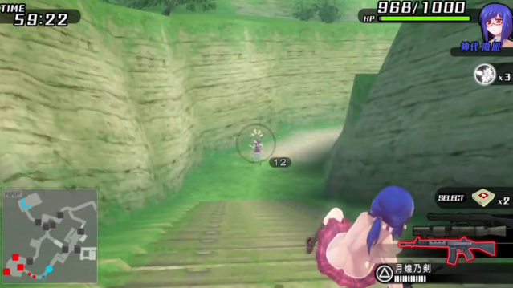

#### テント広場

テント(耐久1200)の処理

* 遠くのもの ... 84mm無反動砲2発
* 近くのもの ... 剣豪で1発。水着モブも巻き込む

テント破壊内訳

<dl>
<dt>84mm無反動砲-R Lv1</dt>
<dd>基礎攻撃力450 * (100% + 35%) = 607.5</dd>
<dt>剣豪(海凪SOD)</dt>
<dd>攻撃力1500</dd>
</dl>

#### ボス

1. 飛び蹴り
1. 剣豪
1. ショットガンでとどめ

## エリア2～3

尋問特訓を飛ばす。

1. 開始直前まではSTART連打 (尋問ITEM選択、チュートリアル)
1. 開始後は START ↑ 〇

アイキャッチを〇で閉じた瞬間にラップ

## 3-A

### 出撃

* 陽希 ... ライジングサン(対物750)
* 優理奈 ... リロード速度+20%

〇連打、↑x2 〇〇、↑〇

### 内容

発電機を3つ破壊する。真面目にスニーキングする必要なし。

1. 中央
1. 橋
1. 緑コンテナ横

発電機破壊内訳

<dl>
<dt>発電機</dt>
<dd>耐久1800、近接-50%</dd>

<dt>ライジングサン</dt>
<dd>攻撃力750</dd>

<dt>陽希近接</dt>
<dd>攻撃力240</dd>

</dl>

<dl>
<dt>バズーカ * 2 + 近接 * 3</dt>
<dd>750 * 2 + 240 * (100% - 50%) * 3 = 1860</dd>
</dl>

## 3-B

### 出撃

* 陽希 ... ライジングサンで一撃全裸
* 優里奈 ... リロード速度+20%、最速入力

〇↓〇〇、↑x2〇〇、↑〇

### 内容

4人ひん剝く。
**バズーカは人に当てづらいので、足元の地面を狙うこと**

1. 開幕の単体モブは無視
1. 次の2人組を剥く (2/4)
1. 階段を駆け上がり、右折。体操着のモブは剥けないので無視
1. 広場の2人組を剥く (4/4)
1. Mission Clear
1. **クリア演出中に緑箱を回収する**

## 3-C

### 出撃

海凪、優里奈

〇↓〇〇、↑x3 〇〇、↑〇

### 内容

開幕は一番右の小部隊を狙う。右に走り去られるとロスるため。
後はヘッドショットゲー。
モブの頭が重なると加速する

## 3-高度任務

### 出撃

海凪、陽希

〇〇↓〇〇、↓x5 〇〇、↑〇

### 内容

#### 輸送機出現前

アサルトでヘッドショットゲー。
右、左、下段、上段の順に敵部隊が出現するので、服を着ている者のみ殲滅する。

殲滅したら速やかに上段に上がり、84mm無反動砲に切り替える。

**ヘルメット水着モブは、倒しづらいうえリスポーンするので無視**

#### 輸送機(耐久1000) 2機出現

84mm無反動砲-R Lv1 プロペラ2発ずつ

1. 向かって右輸送機の、向かって右プロペラを2回撃つ
1. 残りの輸送機の、向かって右プロペラを2回撃つ。2回目は青い箱を目印にする
1. ヘルメット水着モブを殲滅。太ももをアサルトで連射

輸送機破壊内訳

<dl>
<dt>輸送機</dt>
<dd>耐久1000、プロペラ耐性なし</dd>

<dt>84mm無反動砲-R Lv1</dt>
<dd>基礎攻撃力450 * (100% + 35%) = 607.5</dd>
</dl>

<dl>
<dt>プロペラバズーカ * 2</dt>
<dd>607.5 * 2 = 1215</dd>
</dl>

#### 霞未出現

**かわいい**

1. 飛び蹴りで転ばせる
1. 剣豪で全裸にする (下着取得)
1. ショットガンでとどめ

### リザルト

霞未ちゃんのおパンツ・おブラ(SLOT3～)を回収。ヘッドショット強化マテリアルを装備可能

## エリア3～4

尋問特訓を飛ばす。
アイキャッチを〇で閉じた瞬間にラップ

## 4-A

### 出撃前

* 〇連打(メッセージを8つ閉じる)
* L1 (購買部)

**〇連打しすぎ注意**

#### 購買部 

110mm対戦車弾-R Lv2を購入する

1. ↓〇 (武器選択)
1. ↑↑〇 (バズーカ選択)
1. ↓↓〇↑〇〇 (110mm対戦車弾-R Lv1 を選択・購入・入荷メッセージclose)
1. 〇↑〇〇 (110mm対戦車弾-R Lv2 を選択・購入・入荷メッセージclose)
1. ××　(購買部トップに戻る)

**購入操作は受付が遅いのでゆっくりめに**

購買部トップでR1 〇 (レンジャー部へ移動、瑠水のセリフを飛ばす)

#### レンジャー部

110mm対戦車弾-R Lv2、ヘッドショット強化装備

##### 優理奈

###### 武器装備

1. ↓〇 (優理奈選択)
1. ↓〇↑↑〇↑↑〇 (拳銃選択 -> バズーカ系選択 -> 110mm対戦車弾-R Lv2)

###### おブラ カスタマイズ・装備

1. ↓x3 〇 (おブラ選択)
1. ↓x4 〇 ↓←〇 ↑〇 (かすみちゃんのおブラ選択 -> カスタマイズ選択)
1. 〇↑〇 (空スロット選択 -> ヘッドショット強化Lv1装着)
1. ×〇〇 (戻る -> おブラ装備・戻る)

###### おパンツ カスタマイズ・装備

1. ↓ 〇 (おパンツ選択)
1. ↓x4 〇 ↓←〇 ↑〇 (かすみちゃんのおパンツ選択 -> カスタマイズ選択)
1. 〇↑〇 (空スロット選択 -> ヘッドショット強化Lv1装着)
1. ×〇〇 (戻る -> おパンツ装備・戻る)
1. × (キャラ選択に戻る)

##### 咲姫

###### 武器装備

1. ↓x3 〇 (咲姫選択)
1. ↓〇↑↑〇↑↑〇 (拳銃選択 -> バズーカ系選択 -> 110mm対戦車弾-R Lv2)
1. × (キャラ選択に戻る)

##### 海凪

###### 武器装備

1. ↓〇 (海凪選択)
1. ↓〇〇↑↑〇 (84mm無反動砲選択 -> バズーカ系選択 -> 110mm対戦車弾-R Lv2)

###### おブラ装備

1. ↓x3 〇 (おブラ選択)
1. 〇↓←〇〇 (かすみちゃんのおブラ選択 -> 装備・戻る)

###### おパンツ装備

1. ↓〇 (おパンツ選択)
1. 〇↓←〇〇 (かすみちゃんのおパンツ選択 -> 装備・戻る)
1. × (キャラ選択に戻る)

**咲姫は勝負下着にしない。出番が6-高度任務(スニークミッション)しかなく、短縮が見込めないため。**

×連打 (全体マップへ)

### 出撃

* 海凪 ... 最強アサルト、剣豪
* れみれみ ... バズーカ弾速+39%

〇連打、↑x5 〇 ↑〇、↑〇

### 内容

#### 体育館内

アサルトでヘッドショット。殲滅後のリロード不要

#### 屋外

1. 最寄りの装甲車の背面に剣豪
1. 残りの装甲車2台の背面に110mm対戦車弾-R Lv2
1. 水着モブをショットガンで殲滅。脚を狙う

## 4-B

### 出撃

* 海凪 ... SOD「剣豪」 (対物1500)
* れみれみ ... バズーカ弾速+39%

〇↓〇〇、↑x5 〇 ↑〇、↑〇

### 内容

四号戦車2台を破壊する。

1. 開幕で列車の上のモブ2人をアサルトで処理
1. 110mm対戦車弾-R Lv2に持ち替え、向かって右の戦車の右手前へ
1. 右戦車のキャタピラに剣豪 => 右戦車撃破
1. 左戦車の背後にまわり、背面に110mm対戦車弾-R Lv2 => 左戦車撃破
1. Mission Clear

四号戦車破壊内訳

<dl>
<dt>四号戦車</dt>
<dd>耐久1000、背面+25%、キャタピラ-25%、前面-50%</dd>

<dt>剣豪(海凪SOD)</dt>
<dd>基礎攻撃力1500 (対物)</dd>

<dt>110mm対戦車弾-R Lv1</dt>
<dd>基礎攻撃力900</dd>

</dl>

<dl>
<dt>キャタピラ剣豪</dt>
<dd>1500 * (100% - 25%) = 1125</dd>
<dt>背面バズーカ</dt>
<dd>900 * (100% + 25%) = 1125</dd>
</dl>

## 4-C

### 出撃

* 海凪 ... 有能アサルト、SOD (対物1500)
* 月代 ... 最速入力、射程+15%

〇↓〇〇、↑x5 〇〇、↑〇

### 内容

全体をS字を描いて下から巡る。

レーダー破壊内訳

<dl>
<dt>レーダー</dt>
<dd>耐久3000、近接-50%</dd>

<dt>110mm対戦車弾-R Lv2</dt>
<dd>攻撃力900</dd>

<dt>剣豪</dt>
<dd>攻撃力1500</dd>
</dl>

<dl>
<dt>バズーカ + 剣豪 + バズーカ + バズーカ</dt>
<dt>900 + 1500 * (100% - 50%) + 900 + 900 = 3450</dt>
</dl>

装甲車破壊内訳

<dl>
<dt>装甲車</dt>
<dd>耐久1000、背面+25%</dd>

<dt>110mm対戦車弾-R Lv2</dt>
<dd>攻撃力900</dd>
</dl>

<dl>
<dt>背面バズーカ</dt>
<dd>900 * (100% + 25%) = 1125</dd>
</dl>

#### 開幕右手の建物の屋上にモブが居るパターン

レーダー破壊前に小部屋のモブを処理しておく。

## 4-高度任務

### 出撃

* 海凪 ... 最強定期
* 月代 ... 最速入力

〇〇↓〇〇、↑x5 〇〇、↑〇

### 内容

#### 前半

##### 立体迷路

* 校章付近のバリケード
* 返り道のバリケード

は、コンテナから転がることで乗り越えることができる。
貴重なRTAっぽい要素。

#### 後半

##### 殲滅フェーズ

1. 開幕左手のテントを剣豪(2/3)で破壊。スポーンしたモブも巻き込む。
1. 車をよじ登り、水着モブを近接で処理
1. テントを近接+バズーカで破壊 (900 + 360)。スポーンしたモブも巻き込む。
1. 体操着モブ2名をアサルトで処理
1. 飛び降り、左手のテントを近接+バズーカで破壊。スポーンしたモブも巻き込む。
1. 服を着たモブx2を処理する。(ヘッドショット1発)
1. 段差をよじ登り、水着モブを処理
1. テントを剣豪(3/3)で破壊。四号戦車(耐久1000)が動き出す
1. バズーカをリロードし、飛び降り、四号戦車をバズーカで破壊する。(背面1発)
1. 服を着たモブを処理する。
1. 最後のテントを近接+バズーカで破壊する。出来ればモブを巻き込む。

##### ボス

アサルトライフルでヘッドショット。6発。
位置固定なので、側転される心配はない。

## エリア4～5

尋問特訓を飛ばす。
アイキャッチを〇で閉じた瞬間にラップ

## 5-A

### 出撃

* 優理奈 ... 地雷、バズーカ(対物900)
* 陽希 ... バズーカ対物+35%

〇連打、↓〇 ↑x4 〇、↑〇

### 内容

#### 前半(廃墟)

落ち着いてアサルトでヘッドショット。
バズーカのモブは距離を詰めた方が速い

#### 後半(基地)

1. 正面に見えるテントをバズーカで破壊
1. シャッター正面にフラワーマイン(以下、『地雷』)配置
1. 残りのテントを破壊
1. モブを処理
1. シャッター正面に地雷を追加配置
1. タイガー戦車を破壊
   1. 地雷 * 2 命中
   1. 背面バズーカで破壊
1. 体操着モブを処理
   1. 2人組にバズーカ
   1. 3人組にバズーカ
1. 高所のモブリーダーをXN8-R Lv1で処理

テント破壊内訳

<dl>
<dt>テント</dt>
<dd>耐久1200</dd>

<dt>110mm対戦車弾-R Lv2</dt>
<dd>基礎攻撃力900 * (100% + 35%) = 1215</dd>

</dl>

タイガー戦車破壊内訳

<dl>
<dt>タイガー戦車</dt>
<dd>耐久3000 背面耐性なし</dd>

<dt>フラワーマイン</dt>
<dd>攻撃力1200</dd>

<dt>110mm対戦車弾-R Lv2</dt>
<dd>基礎攻撃力900 * (100% + 35%) = 1215</dd>
</dl>

<dl>
<dt>フラワーマイン * 2 + 背面バズーカ</dt>
<dd>1200 * 2 + 1215 = 3615</dd>
</dl>

## 5-B

### 出撃

優理奈、陽希

〇↓〇〇、↓〇 ↑x4 〇、↑〇

### 内容

レーダーを3基破壊する

レーダー破壊内訳

<dl>
<dt>レーダー</dt>
<dd>耐久3000</dd>

<dt>110mm対戦車弾-R Lv2</dt>
<dd>基礎攻撃力900 * (100% + 35%) = 1215</dd>

<dt>敵戦車弾</dt>
<dd>攻撃力750</dd>

</dl>

<dl>
<dt>バズーカ * 3</dt>
<dd>1215 * 3 = 3645</dd>

<dt>バズーカ * 2 + 敵戦車砲</dt>
<dd>1215 * 2 + 750 = 3180</dd>
</dl>

## 5-C

### 出撃

優理奈、陽希

〇↓〇〇、↓〇 ↑x4 〇、↑〇

### 内容

#### 上段

1. 体操着モブ(2人) をXN8-R Lv1で処理
1. 残りの敵を処理
1. 上段にヘルメット部隊(2人)が、下段に通常部隊が出現
1. ヘルメット部隊を処理
   1. 岩陰で一方の攻撃をやりすごし、他方の太腿をアサルトで連射
   1. 残った者の太腿をアサルトで連射

#### 下段

1. 木箱を一つだけ残してバズーカで破壊する。
1. 敵部隊を殲滅する。
1. 残りの木箱を破壊する。敵増援が出現する。
1. 
木箱付近に出現したモブ(2人)を殲滅する。 
**上段のバズーカ部隊、対岸のスナイパー部隊は無視してよい**

1. 岩陰に陣取り、輸送機をバズーカで撃墜(プロペラ一撃)
1. 高確率で味方モブが一人はぐれるため、バズーカで始末する
1. 残りの味方モブが味方装甲車に到達したら、ミッションクリア

## 5-高度任務

### 出撃

優理奈、陽希

〇〇↓〇〇、↓〇 ↑x4 〇、↑〇

### 内容

#### 開幕戦闘ヘリ (1000)

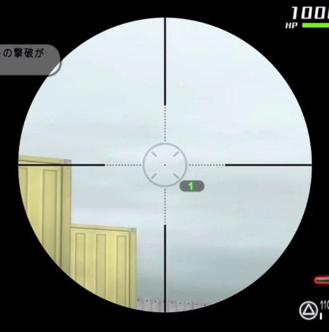

開幕で110mm対戦車弾-R Lv2 に持ち替える。

「ターゲットの撃破が
**【も】**
くてきだぞ」
のタイミングで、写真の位置を撃つ。(1215 * 75% = 約900)

残り100をアサルトライフルで削る。

#### 殲滅フェーズ

ヘッドショットゲー。

**進入禁止区域に敵を吹っ飛ばさないように注意**

#### 連装砲破壊フェーズ

バズーカ(対物900 * 135%=1215) 4発。

**SHIMAKAZE上のモブに気づかれると狙撃されて鬱陶しいので注意**

#### 戦闘ヘリ出現

**戦闘ヘリやSHIMAKAZE上のモブを倒す必要はない**

橋を守るモブを速やかに処理する。

下り坂ではスライド撃ちすると、安定してヘッドショットできる。

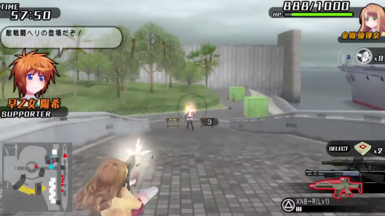

#### 霧乃ちゃん出現

**かわいい**

ユリナカスタムでヘッドショット

## エリア5～6

尋問特訓を飛ばす。
アイキャッチを〇で閉じた瞬間にラップ

## 6-A

### 出撃

海凪、優理奈

〇連打、↑x3〇〇、↑〇

### 内容

クソ乱数ミッション

...に見せかけた収束ミッション

#### 校舎北側～中庭

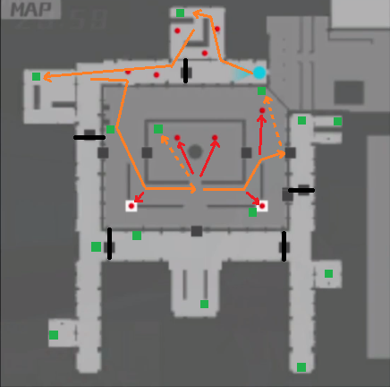

* 運が良いとここで終わるはずだが、一度も引いたことはない

#### 中庭～校舎東側

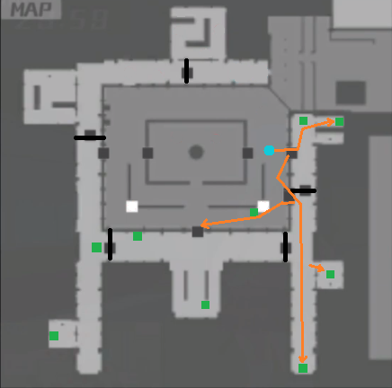

* 跳び箱裏の箱を見落とさないように

#### 校舎西側

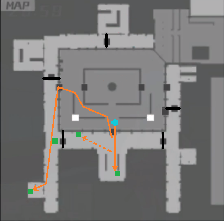

* もうモブを倒す必要はない
* 昇降口の箱は見えづらいので注意

## 6-B

### 出撃

海凪、陽希

〇↓〇〇、↓x5 〇〇、↑〇

### 内容

#### ～輸送機出現

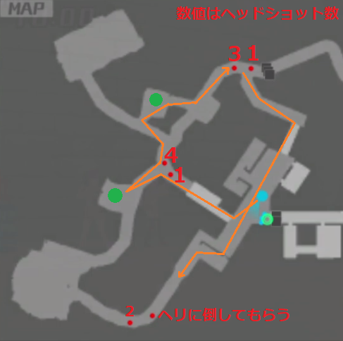

* レーダーを2基破壊
* モブを殲滅

レーダー破壊内訳

<dl>
<dt>レーダー</dt>
<dd>耐久3000、近接-50%</dd>

<dt>110mm対戦車弾-R Lv2</dt>
<dd>基礎攻撃力900 * (100% + 35%) = 1215</dd>

<dt>剣豪</dt>
<dd>攻撃力1500</dd>

</dl>

<dl>
<dt>バズーカ + 剣豪 + バズーカ</dt>
<dd>1215 + 1500 + 1215 = 3930</dd>
<dt>バズーカ * 3</dt>
<dd>1215 * 3 = 3645</dd>
</dl>

#### 輸送機1機目出現

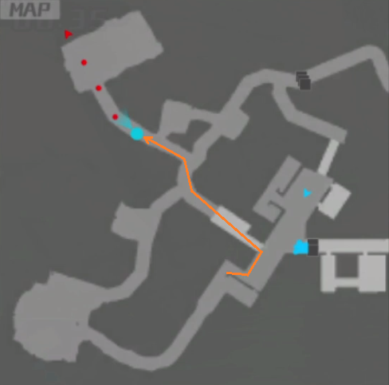

輸送機はローターにバズーカ一発

**他部位では一撃で落ちない**

#### 輸送機2機目出現

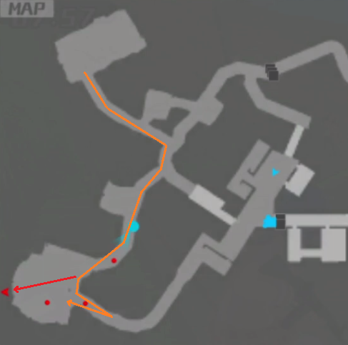

輸送機はローターにバズーカ一発

**他部位では一撃で落ちない**

#### 輸送機破壊後

1. 小道のハンドガン部隊を処理
1. 広場に引き返し、ショットガン部隊を処理

輸送機破壊内訳

<dl>
<dt>輸送機</dt>
<dd>耐久1000、プロペラ耐性なし、他部位-25%～</dd>

<dt>110mm対戦車弾-R Lv2</dt>
<dd>基礎攻撃力900 * (100% + 35%) = 1215</dd>

</dl>

<dl>
<dt>プロペラバズーカ</dt>
<dd>1215</dd>
</dl>

## 6-C

### 出撃

海凪、優理奈

〇↓〇〇、↑x3 〇〇、↑〇

### 内容

#### カードキー集め

カードキーを持つモブは固定。(3人)

1. 1枚目のカードキーを持つモブを最後に倒す。隔壁が3箇所開き、第2部隊が登場する。
1. 中央の隔壁を閉じる。
1. 2枚目のカードキーを持つモブを最初に倒し、ステージ最奥の隔壁を閉じる。
1. 第2部隊を殲滅する。第3部隊が登場する。
1. 3枚目のカードキーを持つモブを最初に倒し、残りの隔壁を閉じる。
1. 第3部隊を殲滅する。モブリーダー+ショットガン部隊が出現する。

#### モブリーダー出現

1. ショットガン部隊(3人)のうち、最奥の1人を処理する。
1. 建物屋上のモブリーダー(2人)を処理する。片方は剣豪+アサルトで倒す。

**最奥のショットガンモブを討ち漏らすと、広大なフィールドの外縁を走り回り、始末に時間がかかる**

## 6-高度任務

### 出撃

* 咲姫   ... 強制
* 優理奈 ... リロード速度+20%

〇〇↓〇〇、〇↓〇、↑〇

### 内容

#### スニーク

* 本作は初代と異なり「足音」でバレる。
  モブ付近を通るときは、走らずに歩くこと
* 大部屋では下記のいずれかでモブをやり過ごすことができる。モブ待ちがあるのでタイム差はない
  * 木箱裏
  * コントロールパネル横
* 大部屋から離脱する際のモブは背後からショットガンで転ばせ、起き上がる前に離脱可能。
  **飛び蹴りは不可**

#### ボス

ショットガンでヘッドショット数回。

**進入禁止区域にボスを吹っ飛ばさないよう注意**

## エリア6～7

尋問特訓を飛ばす。
アイキャッチを〇で閉じた瞬間にラップ

## 7-A

### 出撃前

* 〇連打 (メッセージを9つ閉じる)
* L1 (購買部へ)

**〇連打しすぎ注意**

#### 購買部 

XN8-R Lv3 を購入する

1. ↓〇 (武器選択)
1. ↓x3 〇 (アサルトライフル系選択)
1. ↓〇↑〇〇 (XN8-R Lv2 を選択・購入・入荷メッセージclose)
1. 〇↑〇 (XN8-R Lv3 を選択・購入)
1. ××　(購買部トップに戻る)

**購入操作は受付が遅いのでゆっくりめに**

購買部トップでR1 〇連打 (レンジャー部へ移動、瑠水のセリフを飛ばす)

#### レンジャー部

固有武器-改、XN8-R Lv3、110mm対戦車弾-R Lv2、勝負下着装備

##### 優理奈

###### 武器装備

1. ↓〇 (優理奈選択)
1. 〇↓〇 (M870ユリナカスタム改 装備)
1. ↓↓〇〇↓↓〇 (XN8-R Lv3 装備)
1. × (キャラ選択に戻る)

##### 月代

###### 武器装備

1. ↓↓〇 (月代選択)
1. 〇↓〇 (シャドウスナイパー改 装備)
1. ↓〇↑↑〇↑↑〇 (拳銃選択 -> バズーカ系選択 -> 110mm対戦車弾-R Lv2)
1. × (キャラ選択に戻る)

##### 海凪

###### 武器装備

1. ↓↓〇 (海凪選択)
1. 〇↓〇 (月煌乃剣改 装備)
1. × (キャラ選択に戻る)

##### 陽希

###### 武器装備

1. ↓〇 (陽希選択)
1. 〇↓〇 (ライジングサン改 装備)
1. ↓〇↓↓↓〇↓↓〇 (拳銃選択 -> アサルト系選択 -> XN8-R Lv3 選択・装備)

###### おブラ装備

1. ↓x3 〇 (おブラ選択)
1. ↑〇 ↓←〇〇 (かすみちゃんのおブラ選択・装備・戻る)

###### おパンツ装備

1. ↓ 〇 (おパンツ選択)
1. ↑〇 ↓←〇〇 (かすみちゃんのおブラ選択・装備・戻る)
1. × (キャラ選択に戻る)

##### 麻衣

###### 武器装備

1. ↓〇 (麻衣選択)
1. ↓〇〇↓↓〇 (XN8-R Lv1 選択 -> アサルト系選択 -> XN8-R Lv3 選択・装備)
1. ↓〇↓↓↓〇↑↑〇 (M870MCS-R Lv1 選択 -> バズーカ系選択 -> 110mm対戦車弾-R Lv2 選択・装備)

###### おブラ装備

1. ↓x2 〇 (おブラ選択)
1. ↑↑〇 ↓←〇〇 (かすみちゃんのおブラ選択・装備・戻る)

###### おパンツ装備

1. ↓ 〇 (おパンツ選択)
1. ↑↑〇 ↓←〇〇 (かすみちゃんのおブラ選択・装備・戻る)
1. × (キャラ選択に戻る)

装備表

| キャラ | 固有武器-改 | XN8-R Lv3 | 110mm対戦車弾-R Lv2 | 勝負下着 |
|--------|---|---|---|---|
| 優理奈 |o|o|-|-|
| 月代   |o|x|o|x|
| 海凪   |o|x|-|-|
| 陽希   |o|o|x|o|
| 麻衣   |x|o|o|o|

<dl>
<dt>o</dt>
<dd>装備する</dd>
<dt>x</dt>
<dd>装備しない</dd>
<dt>-</dt>
<dd>装備済</dd>
</dl>

##### 考察

* 月代ちゃんはスナイパーとバズーカしか使わない。下記理由につき勝負下着不要
  * スナイパー
    * ヘルメット(服)にはヘッドショット強化が適用されない
    * 素顔なら強化なしでもワンキル
  * バズーカ
    * ヘッドショットは発動しない
* 麻衣部長の固有武器は使わないので改にしない

×連打 (全体マップへ)

### 出撃

* 陽希 ... ライジングサン改(対物1500)で木箱一撃
* 優理奈 ... リロード速度+20%、最速入力

〇連打、↑x3 〇 ↑〇、↑〇

### 内容

以下を、味方戦車が停まらないよう、速やかにこなす。

1. 重要モブ(ミニマップ上で赤い輪がついている者)をXN8-R Lv3で殲滅。
1. 木箱をバズーカで破壊
1. モブリーダーをバズーカ2発(全裸) -> XN8-R Lv3でとどめ
1. 木箱をバズーカで破壊
1. 敵戦車をバズーカで撃破(背面2発)
1. 木箱をバズーカで破壊
1. 敵戦闘ヘリをバズーカで撃墜(メインローター1発)
1. 味方戦車が目的地に到達したらミッションクリア

### 注意事項

* **装甲車は破壊不要**
* **崖から突き落とされると数十秒ロスる。バズーカモブには要注意**

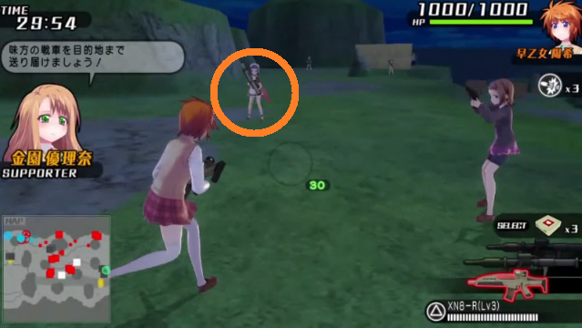

## 7-B

### 出撃

陽希、優理奈

〇↓〇〇、↑x3 〇 ↑〇、↑〇

### 内容

バズーカで戦車3台を撃破する。

1. 橋付近の四号戦車(キャタピラ1発)
1. 広場のタイガー式戦車(背面2発)
1. 細い道から出てくる10式戦車(背面3発)

## 7-C

### 出撃

* 月代 ... モブ暗殺要員。見つかる前に始末する
* 陽希 ... バズーカ対物+35%

〇↓〇〇、↓x2 〇 ↓x2 〇、↑〇

### 内容

#### マップ

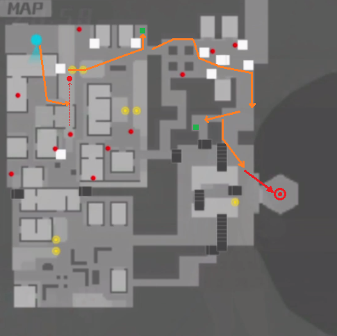

#### 暗殺

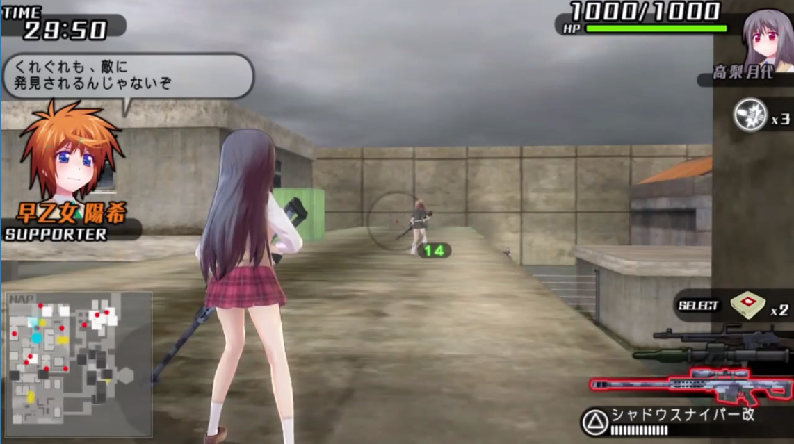

1. 階段を中程まで登り、モブが飛び出してくるのを待つ
1. モブを背後からヘッドショット

#### カードキー回収～使用

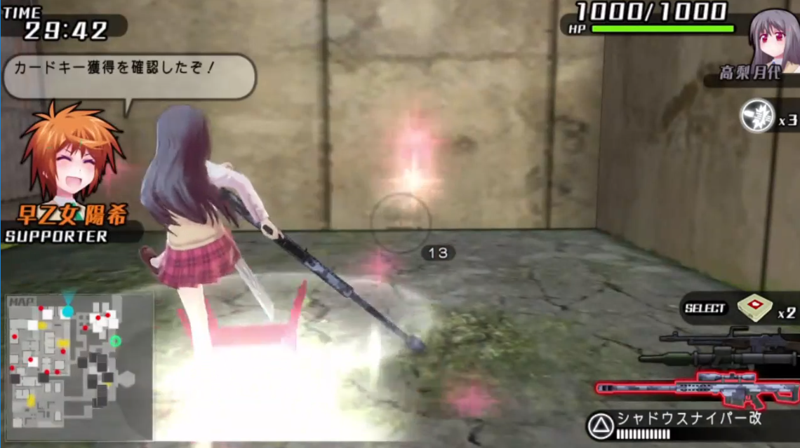

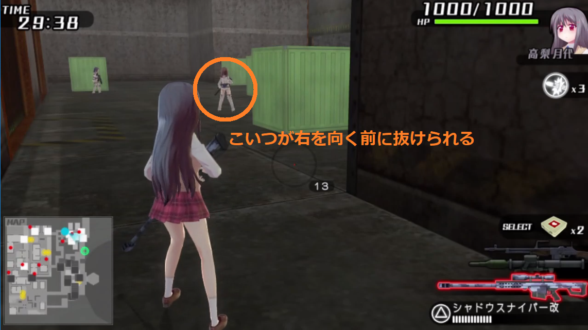

残42～43秒時点でカードキーを回収できると、そのあとの見張りを1周期スキップできる。

#### ヘリ撃破

テールローター2発、 1215 * 2

## 7-高度任務

### 出撃

* 麻衣 ... 強制
* 陽希 ... 最速入力、バズーカ対物+35%、強制

〇〇↓〇〇、〇〇、↑〇

### 内容

#### 殲滅フェーズ

XN8-R Lv3でヘッドショット

#### テント破壊フェーズ

110mm対戦車弾-R Lv2 で一撃。
水着モブを巻き込めると良い

#### 線路渡りフェーズ

赤箱のいずれか一つにカードキーが入っている。

##### 検討事項

装甲車を破壊する必要があるか

#### 殲滅フェーズ2

ミニマップ上で赤丸の付いているモブ・戦車の殲滅

四号戦車は背面バズーカ一発

四号戦車破壊内訳

<dl>
<dt>四号戦車</dt>
<dd>耐久1000、背面+25%</dd>

<dt>110mm対戦車弾-R Lv2</dt>
<dd>基礎攻撃力900 * (100% + 35%) = 1215</dd>
</dl>

<dl>
<dt>背面バズーカ</dt>
<dd>1215 * (100% + 25%) = 1519</dd>
</dl>

#### ボス

距離を詰めてXN8-R Lv3でヘッドショット

## エリア7～8

逆尋問特訓を飛ばす。
**チュートリアルをSTART連打で飛ばす**

アイキャッチを〇で閉じた瞬間にラップ

## 8-A

### 出撃

* 月代 ... 半強制、スナイパーヘッドショットでモブ一撃
* れみれみ ... 半強制

〇連打、↓〇↑〇、↑〇

### 内容

地図持ちの敵の配置は4通り。

2人組のうち、基本的に左の敵が地図を落とす。
ヘルメットの敵もスナイパーでヘッドショット。

爆弾の配置はおそらくランダム

## 8-B

### 出撃

* 優理奈 ... 半強制、ショットガンでモブリーダー一撃
* 彩 ... 半強制

〇↓〇〇、↓〇↑〇、↑〇

### 内容

モブリーダーをショットガンでヘッドショット。

## 8-C

### 出撃

* 海凪 ... 半強制、アサルト
* 咲姫 ... 半強制

〇↓〇〇、↓〇↑〇、↑〇

### 内容

タイガー戦車破壊内訳

<dl>
<dt>タイガー戦車</dt>
<dd>耐久3000、背面耐性なし、キャタピラ-50%</dd>

<dt>110mm対戦車弾-R Lv2</dt>
<dd>基礎攻撃力900</dd>

<dt>剣豪</dt>
<dd>攻撃力1500</dd>

</dl>

1. 向かって左から背面にまわり、バズーカ
1. リロードが終わったらキャタピラ剣豪
1. 背面バズーカ * 2

900 + 1500 * (100% - 50%) + 900 * 2 = 3450

**剣豪が背面に入るとバズーカが一発少なくて済む**

戦闘ヘリ破壊内訳

<dl>
<dt>戦闘ヘリ</dt>
<dd>耐久2000、メインローター-25%、前部-50%、胴体-75%</dd>

<dt>110mm対戦車弾-R Lv2</dt>
<dd>基礎攻撃力900</dd>

</dl>

<dl>
<dt>メインローター * 3</dt>
<dd>900 * (100% - 25%) * 3 = 2025</dd>
</dl>

## 8-高度任務

### 出撃

* 優理奈 ... 強制
* 彩 ... 半強制

〇〇↓〇〇、〇〇、↑〇

### 内容

#### 10式戦車(耐久4000)

地雷(対物1200)を埋めつつ、隠れてバズーカ(900 * 135% = 1215)

#### ボス

1. 一方を飛び蹴りで転ばせ、他方にショットガンヘッドショット
1. 起き上がった者をショットガンヘッドショット
1. 繰り返す。

## エリア8～9

ダブル尋問特訓を飛ばす。
**チュートリアルをSTART連打で飛ばす**

アイキャッチを〇で閉じた瞬間にラップ

## 9-A

### 出撃

海凪、優理奈

〇連打、↑x3 〇〇、↑〇

### 内容

モブを30人倒す。

1. 中庭のショットガンモブ(ピンク)を殲滅
1. 正面から校舎に進入し、次のモブを殲滅
   1. バズーカモブ(メイド) x 2
   1. リボルバーモブ(水着)
1. 中庭に戻り、アサルトモブ(レンジャー)を殲滅
1. 右上上空から輸送機出現。撃墜
1. 倒しやすいモブから殲滅。 頭装備なし > カチューシャ > ヘルメット

## 9-B

### 出撃

* 月代 ... モブ暗殺要員。見つかる前に始末する
* 咲姫 ... 弾丸が大きくなり当たりやすくなる＆最速入力のため

〇↓〇〇、↓x3 〇〇、↑〇

### 内容

最後のスニーキングミッション

TODO: 地図掲載

1. 開幕左折
1. 壁を縫うように移動
1. 大部屋へ侵入、右側へ
1. モブにヘッドショット
1. 廃墟へ
1. 最寄りのモブにヘッドショット
1. 発電機をバズーカx2で破壊(900 x 2 = 1800)
1. パンツ付近のモブにヘッドショット
1. パンツ回収
1. 来た道を帰る

### 検討事項

開幕で稀にショットガンモブに発見されてしまう。条件は？

## 9-C

### 出撃

海凪、陽希

〇↓〇〇、↓x5 〇〇、↑〇

### 内容

#### 前半 (モブリーダーx3撃破まで)

中距離からアサルトでヘッドショット。

**敵部隊に接近しすぎると、コンテナから水着モブがスポーンしてしまう**

##### モブリーダー2人目

段差をよじ登り、屋根の上から狙撃する。

**先に進みすぎると水着モブがスポーンするので注意**

##### モブリーダー3人目

側転で死角に隠れられるのが厄介である。

* 倒すために接近せざるを得なくなり、水着モブがスポーンしてしまう。
* 水着モブを相手にしていると、次に現れる輸送機を早期撃墜できなくなる。

屋根の上からバズーカで足元を狙撃し、爆風で奥に押し込む。
こうすることで、側転されても、コンテナや車にぶつかり、死角に入られなくなる。

#### 後半

##### 輸送機(耐久2000)

プロペラにバズーカ2発 (900 * 135% * 2 = 2430)

##### 10式戦車(耐久4000)

背面バズーカ(900 * 135%) * 2 + 背面剣豪(1500) = 3930

* 70足りないが、流れ弾でなんとかする
* 剣豪でめり込むと轢き殺されるので、背面バズーカ3発+αの方が安全かも

## 9-高度任務

### 出撃

海凪、陽希

〇〇↓〇〇、↓x5〇〇、↑〇

### 内容

#### 前半

##### 探査ヘリ(耐久1000)

テールを狙えると良い

##### タイガー戦車(耐久3000)・四式戦車(耐久1000)

* タイガー戦車 
  * 背面バズーカ三発 (900 * 135% * 3 = 3645)
  * 背面バズーカ二発 + 敵戦車砲 (900 * 135% * 2 + 750 = 3180)
* 四式戦車 背面バズーカ一発 (900 * 135% = 1215)

##### 10式戦車(耐久6000)・連装砲(耐久4000) x 2

1. 橋を渡り、左の河口に陣取る。ここなら戦車に狙われることはまずない
1. 連装砲 x 2 を撃破する。バズーカx4 (900 * 135% * 4 = 4860)
1. テント(耐久1200) を破壊する。 バズーカ一発 (900 * 135% = 1215)
1. 高所の狙撃モブ x 2 をアサルトで処理
1. 戦車を破壊。背面バズーカ5発 (900 * 135% * 5 = 6075)

**リロード不要(後半マップへ移動する際に自動で行われる)**

#### 後半

STUB

## エリア9～10

尋問特訓を飛ばす。

エンディングをSTART連打で飛ばす。

タイトルへ戻り、再度「岬守学園」を選択した瞬間にラップ

## エリア10

### 出撃

* 優里奈 ... 地雷で自害
* れみれみ ... 最速入力

〇連打、↓〇〇、↑〇

### 内容

簡易任務がランダムに選ばれる

#### 戦車の出現するミッション (4-Bなど)

戦車に轢いてもらう

#### その他

モブに密着して地雷を設置すると、即座に爆発して巻き込まれることができる。(対人・対服1200)
2発で自害できる。

### エリア10～タイマーストップ

△長押しで会話を飛ばす。
全体マップで学園エンブレムが表示されたらタイマーストップ
