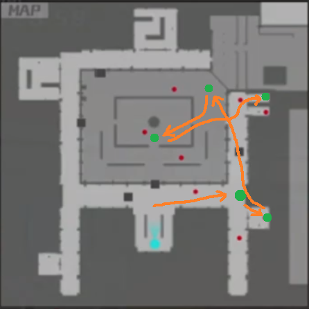
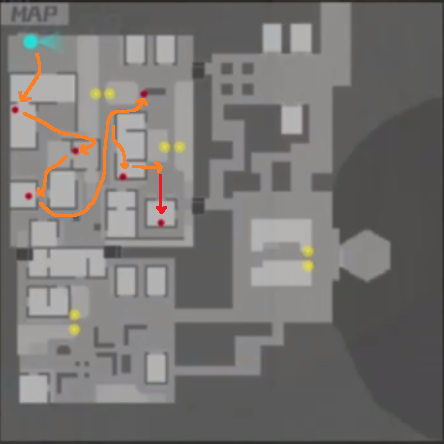
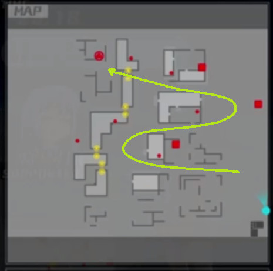
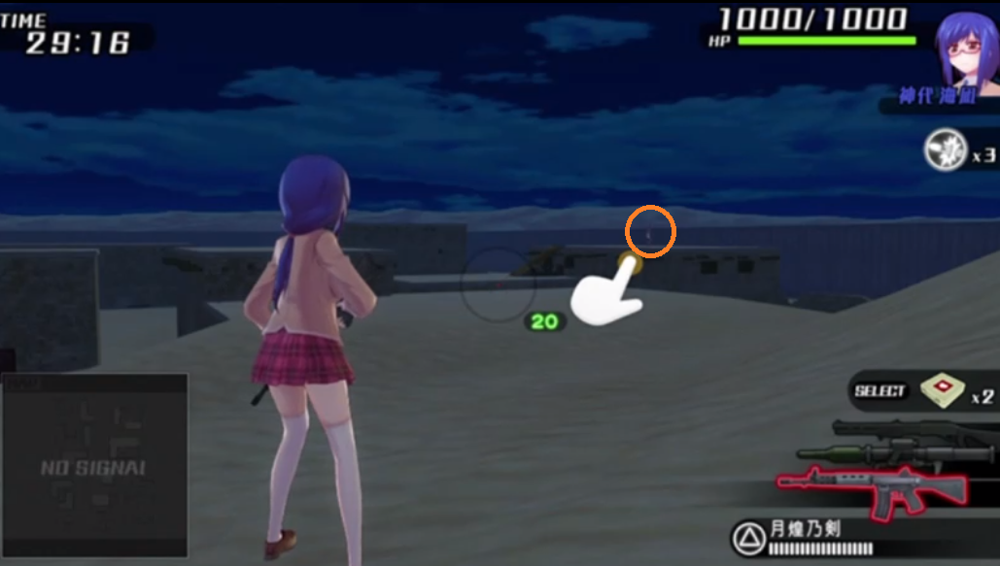
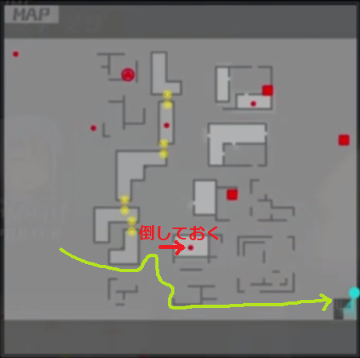
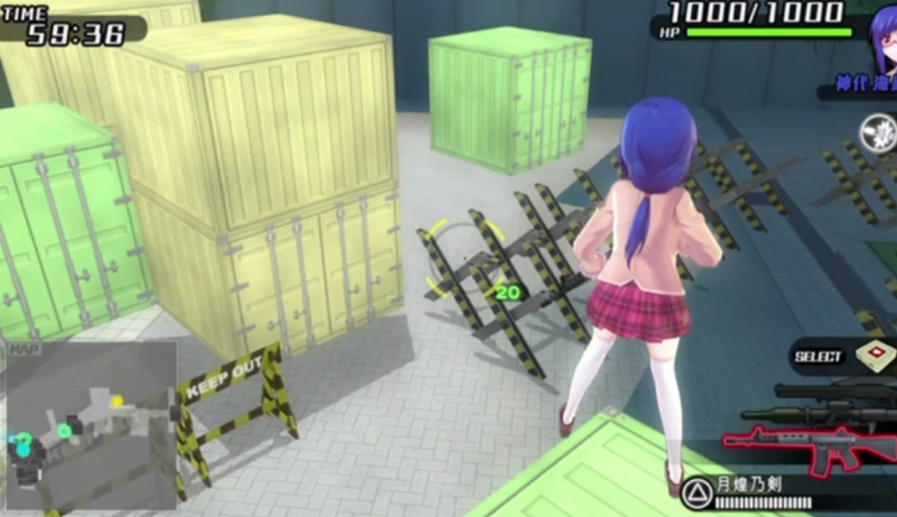
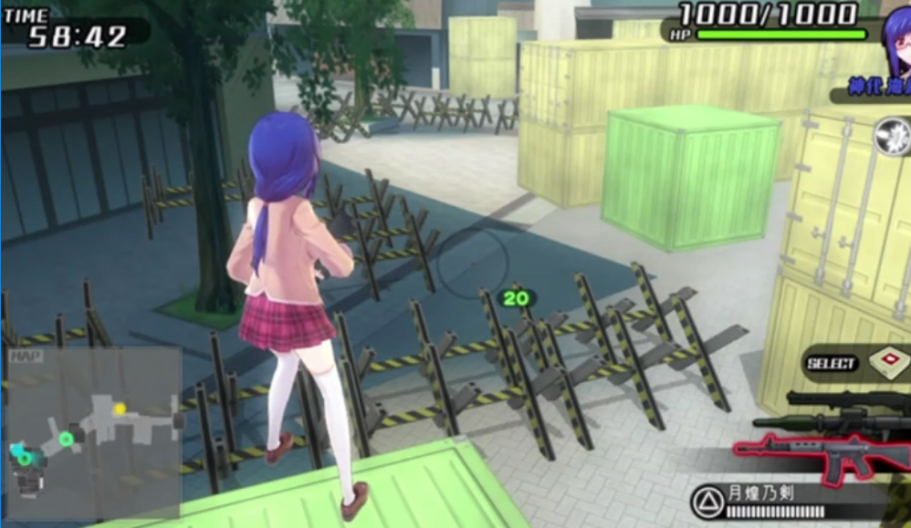
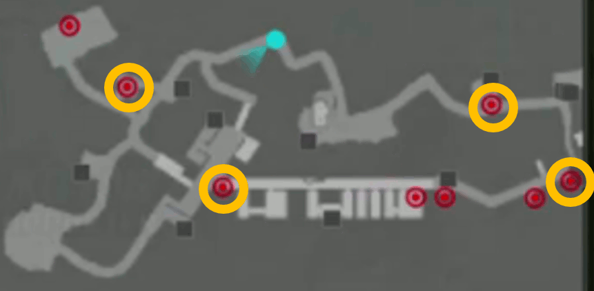
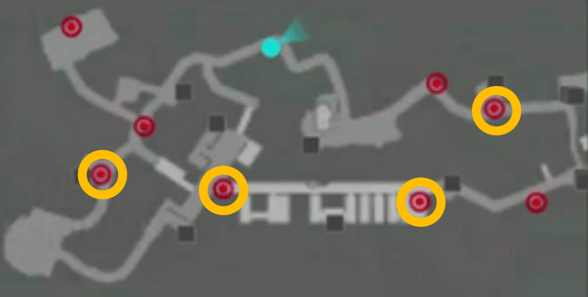
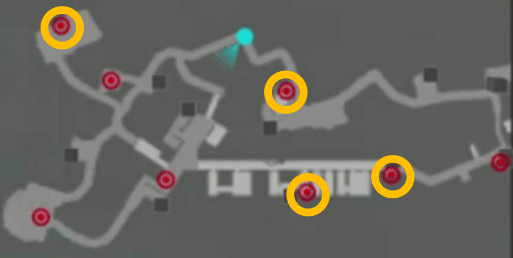

# Bullet Girls 2 New Game 岬守学園 RTA

## タイマー

<dl>
<dt>タイマースタート</dt>
<dd>岬守学園を選択した瞬間</dd>
<dt>タイマーストップ</dt>
<dd>エリア10攻略後、全体マップで操作可能になった瞬間</dd>
</dl>

## タイマースタート～エリア1
△長押しで会話を飛ばす。
余裕があればおっぱいをタッチする。

アイキャッチは〇で飛ばす。

## 1-A

### 出撃

* 月夜 ... シャドウスナイパーでヘッドショット一発
* 咲姫 ... 弾丸が大きくなり当たりやすくなる＆最速入力のため

〇連打、↓x3 〇連打、↑〇

**「出撃しますか？」はデフォルト「いいえ」なので注意**

### 内容
開幕でチュートリアルが始まる。

チュートリアルスキップ～オプション設定

* START, START, ↑, 〇　(オプション選択)
* →↓→↓→　(脱衣演出OFF)
* ↑ x 4 →　(キーコンフィグ2)
* ↑↑　←←↑←←↑→→　(スティック感度を調整。構え時最遅、他最速)
* ×連打　(オプション離脱)

**×を押しすぎてしゃがまないよう注意**

モブはすべてシャドウスナイパーのヘッドショットで一撃。
最後のモブ以外は動かないため、落ち着いて狙う。

**2人組の2人目を最速で狙うと連射性能が追い付かないため、少し待って撃つこと**

モブの出現場所・人数

1. 前(2)
1. 左(2)
1. 右(2)
1. 前(1)

### 備考
ミッション開始演出・リザルトは〇連打で飛ばす

## 1-B

### 出撃 

* 陽希 ... 選択可能な中で最高身長、走る速さもおそらく最速
* 優理奈 ... 最速入力のため

〇〇↓〇〇、↑x2 〇連打、↑〇

### 内容

チュートリアルを閉じつつ走る。

コントローラの持ち方

<dl>
<dt>右中指</dt>
<dd>R1(ダッシュ)</dd>
<dt>右人差し指</dt>
<dd>STARTボタン(チュートリアル閉じる)</dd>
</dl>

コンテナから降りるときは転がった方が多分早い。
**R1を離し、左スティック + ×**

### 注意事項

* 転がる際、R1を押していると「飛び込み」になりロスる
* 慣性が残っているとドラム缶を蹴れない

### 備考

* このゲームでは、走る速さは身長に比例する模様。(正比例かは不明)

## 1-C

### 出撃

陽希、優理奈

〇〇↓〇〇、↑x2 〇連打、↑〇

### 内容

[1-Bと同様の持ち方](#controller-tutorial)でひた走る。

### 注意事項

* 赤箱の部屋では高確率でバズーカが飛んでくる

## 1-高度任務

### 出撃
* 海凪　... 最強アサルトライフル『月煌乃剣』所持
* 優理奈　... リロード速度+20%、最速入力

〇〇↓〇〇、↑x3〇連打、↑〇

### 内容

開幕チュートリアルをSTARTで飛ばす。
ヘッドショット

## エリア1～2

### 会話パート

△で会話を飛ばす。
**アイキャッチを〇で閉じた瞬間にラップ。**

### 全体マップ
任務追加、購買部入荷メッセージ等を〇連打で飛ばす。

## 2-A

### 出撃

* 麻衣 ... 部内最高身長、選択も早い
* 優理奈　... 最速入力のため

〇連打、↑〇連打、↑〇

### 内容
走り、ドラム缶を蹴る

身長と走る速さの関係

|キャラ|身長(cm)|所要時間(sec)|
|:----|-------:|-----------:|
|麻衣  |165     |          13|
|彩　  |152     |          14|
|咲姫  |140     |          15|

## 2-B

### 出撃前
L1連打 (購買部へ)

#### 購買部 

84mm無反動砲を購入する

* ↓〇 (武器選択)
* ↑↑〇 (バズーカ選択)
* 〇↑〇〇 (84mm無反動砲-R Lv1 を選択・購入・入荷メッセージclose)
* ××　(購買部トップに戻る)

**購入操作は受付が遅いのでゆっくりめに**

ヘッドショット強化Lv1を購入する

* ↓x4 〇 (マテリアル選択)
* 〇 (攻撃系選択)
* ↑〇↑〇〇 (->ヘッドショット強化Lv1 を選択・購入・入荷メッセージclose)
* ××　(購買部トップに戻る)

**購入操作は受付が遅いのでゆっくりめに**

購買部トップでR1 〇連打 (レンジャー部へ、瑠水のセリフを飛ばす)

#### レンジャー部

海凪に84mm無反動砲を装備させる

* ↓x5 〇(海凪選択)
* ↓〇 (9mm拳銃選択)
* ↑↑〇〇 (バズーカ -> 84mm無反動砲-R Lv1 装備)

×連打 (全体マップへ)

**下着のスロットが足りないため、マテリアルはまだ装備できない**

### 出撃

麻衣、優理奈

**〇△△↓〇〇　(難易度をEASYにする)**、
↑〇連打、
↑〇

### 内容

道なりに進み、赤箱を回収する

## 2-C

### 出撃

海凪、優理奈

〇↓〇〇、↑ x 3 〇連打、↑〇

### 内容

ヘッドショット殲滅ゲー

リロードは1回で

## 2-高度任務

### 出撃

* 海凪　... 最強アサルト
* 陽希　... バズーカ対物+35%、最速入力

〇〇↓〇〇、↓ x 5 〇連打、↑〇

### 内容

STUB
(地図掲載予定)

#### テント広場

テント(耐久1200)の処理

* 遠くのもの ... 84mm無反動砲2発
* 近くのもの ... 水着モブもろとも剣豪で1発

詳細

<dl>
<dt>84mm無反動砲-R Lv1</dt>
<dd>基礎攻撃力450 * (100% + 35%) = 607.5</dd>
<dt>剣豪(海凪SOD)</dt>
<dd>基礎攻撃力1500 (対物)</dd>
</dl>

#### ボス

1. 飛び蹴り
1. 剣豪
1. ショットガン等でとどめ

## エリア2～3

尋問特訓を飛ばす。

* 開始直前まではSTART連打 (尋問ITEM選択、チュートリアル)
* 開始後は START ↑ 〇

アイキャッチを〇で閉じた瞬間にラップ

## 3-A

### 出撃

* 陽希 ... ライジングサン(対物750)
* 優理奈　... リロード速度+20%

〇連打、↑x2 〇連打、↑〇

### 内容

発電機(耐久1800、近接-50%) を3つ破壊する。
中央 -> 橋 -> 緑コンテナ横 の順。
真面目にスニーキングする必要なし。

発電機は バズーカ x 2 + 近接 x 3 で破壊する
(750 * 2 + 240 * 50% * 3 = 1860)

## 3-B

### 出撃

* 陽希 ... ライジングサンで一撃全裸
* 優里奈　... リロード速度+20%、最速入力

〇↓〇〇、↑x2〇連打、↑〇

### 内容

4人ひん剝く。
**バズーカは人に当てづらいので、足元の地面を狙うこと**

1. 開幕のモブは無視
1. 次の2人組を剥く
1. 階段を駆け上がり、右折。体操着のモブは剥けないので無視
1. 広場の2人組を剥く

この際、誰のおパンツ・おブラを回収したかを記憶する。

## 3-C

### 出撃

海凪、優里奈

〇↓〇〇、↑x3 〇連打、↑〇

### 内容

開幕は一番右の小部隊を狙う。右に走り去られるとロスるため。
後はヘッドショットゲー。
モブの頭が重なると加速する

## 3-高度任務

### 出撃

海凪、陽希

〇〇↓〇〇、↓x5 〇連打、↑〇

### 内容

#### 輸送機出現前

アサルトでヘッドショットゲー。
右、左、下段、上段の順に敵部隊が出現するので、服を着ている者のみ殲滅する。

殲滅したら速やかに上段に上がり、84mm無反動砲に切り替える。

**ヘルメット水着モブは、倒しづらいうえリスポーンするので無視**

#### 輸送機出現後

輸送機の耐久は1000。

向かって右の輸送機のプロペラを、84mm無反動砲で2回撃つ。
(450 * (100% + 35%)  * 2 = 1215)

向かって左の輸送機は、プロペラに剣豪で攻撃する。
(1500)

ヘルメット水着モブを殲滅する。
バズーカか、太ももをアサルトで連射すると良い

#### 霞未出現

かわいい

バズーカ -> 剣豪 -> バズーカ

**剣豪貯まるの待たされるかも**

### リザルト

霞未ちゃんのおパンツ・おブラ(SLOT3～)を回収できる

## エリア3～4

尋問特訓を飛ばす。
アイキャッチを〇で閉じた瞬間にラップ

## 4-A

### 出撃前

〇連打 => L1 (購買部)

**〇連打しすぎ注意**

#### 購買部 

110mm対戦車弾-R Lv2を購入する

* ↓〇 (武器選択)
* ↑↑〇 (バズーカ選択)
* ↓↓〇↑〇〇 (110mm対戦車弾-R Lv1 を選択・購入・入荷メッセージclose)
* 〇↑〇〇 (110mm対戦車弾-R Lv2 を選択・購入・入荷メッセージclose)
* ××　(購買部トップに戻る)

**購入操作は受付が遅いのでゆっくりめに**

購買部トップでR1 〇連打 (レンジャー部へ移動、瑠水のセリフを飛ばす)

#### レンジャー部

110mm対戦車弾-R Lv2、ヘッドショット強化装備

##### 優理奈

###### 武器装備

1. ↓〇 (優理奈選択)
1. ↓〇↑↑〇↑↑〇 (拳銃選択 -> バズーカ系選択 -> 110mm対戦車弾-R Lv2)

###### おブラ カスタマイズ・装備

1. ↓x3 〇 (おブラ選択)
1. ↓x4 〇 ↓←〇 ↑〇 (かすみちゃんのおブラ選択 -> カスタマイズ選択)
1. 〇↑〇 (空スロット選択 -> ヘッドショット強化Lv1装着)
1. ×〇〇 (戻る -> おブラ装備・戻る)

###### おパンツ カスタマイズ・装備

1. ↓ 〇 (おパンツ選択)
1. ↓x4 〇 ↓←〇 ↑〇 (かすみちゃんのおパンツ選択 -> カスタマイズ選択)
1. 〇↑〇 (空スロット選択 -> ヘッドショット強化Lv1装着)
1. ×〇〇 (戻る -> おパンツ装備・戻る)
1. × (キャラ選択に戻る)

##### 咲姫

###### 武器装備

1. ↓x3 〇 (咲姫選択)
1. ↓〇↑↑〇↑↑〇 (拳銃選択 -> バズーカ系選択 -> 110mm対戦車弾-R Lv2)
1. × (キャラ選択に戻る)

##### 海凪

###### 武器装備

1. ↓〇 (海凪選択)
1. ↓〇〇↑↑〇 (84mm無反動砲選択 -> バズーカ系選択 -> 110mm対戦車弾-R Lv2)

###### おブラ装備

1. ↓x3 〇 (おブラ選択)
1. 〇↓←〇〇 (かすみちゃんのおブラ選択 -> 装備・戻る)

###### おパンツ装備

1. ↓〇 (おパンツ選択)
1. 〇↓←〇〇 (かすみちゃんのおパンツ選択 -> 装備・戻る)
1. × (キャラ選択に戻る)

**咲姫は下着装備ぶんの時間を回収できそうにないため、勝負下着にしない**

×連打 (全体マップへ)

### 出撃

* 海凪 ... 最強アサルト、剣豪
* れみれみ ... バズーカ弾速+39%

〇連打、↑x5 〇 ↑〇、↑〇

### 内容

#### 体育館内

アサルトでヘッドショット。殲滅後のリロード不要

#### 屋外

1. 最寄りの装甲車の背面に剣豪
1. 残りの装甲車2台の背面に110mm対戦車弾-R Lv2
1. 水着モブをショットガンで殲滅。脚を狙う

## 4-B

### 出撃

* 海凪 ... SOD「剣豪」 (対物1500)
* れみれみ ... バズーカ弾速+39%

〇↓〇〇、↑x5 〇 ↑〇、↑〇

### 内容

1. 開幕で列車の上のモブ2人をアサルトで処理
1. 110mm対戦車弾-R Lv2に持ち替え、向かって右の戦車の右手前へ
1. 右戦車のキャタピラに剣豪 => 右戦車撃破
1. 左戦車の背後にまわり、背面に110mm対戦車弾-R Lv2 => 左戦車撃破
1. Mission Clear

### 注意事項

* 剣豪は前面だと一撃で落ちない
* 110mm対戦車弾-R Lv2は、背面以外だと一撃で落ちない

## 4-C

### 出撃

* 海凪 ... 有能アサルト、SOD (対物1500)
* 月夜 ... 最速入力、射程+15%

〇↓〇〇、↑x5 〇連打、↑〇

### 内容

全体をS字を描いて下から巡る。

レーダー(耐久3000、近接-50%) は、
バズーカ + 剣豪 + バズーカ + バズーカ (900 + 1500*0.5 + 900 + 900 = 3450)
で破壊する。

装甲車は背面バズーカで一撃。

#### 開幕右手の建物の屋上にモブが居るパターン

レーダー破壊前に小部屋のモブを処理しておく。

## 4-高度任務

### 出撃

* 海凪 ... 最強定期
* 月夜 ... 最速入力

〇〇↓〇〇、↑x5 〇連打、↑〇

### 内容

#### 前半

##### 立体迷路

* 校章付近のバリケード
* 返り道のバリケード

は、コンテナから転がることで乗り越えることができる。
貴重なRTAっぽい要素。

#### 後半

##### 殲滅フェーズ

1. 開幕左手のテントを剣豪(1/3)で破壊する。スポーンしたモブも巻き込む。
1. 車をよじ登り、テントをバズーカで処理する。(2発)
1. 体操着モブ・スポーンしたモブを処理する。
1. 飛び降り、服を着たモブx2を処理する。
1. 左手のテントを剣豪(2/3)で破壊する。スポーンしたモブも巻き込む。
1. 段差をよじ登り、体操着モブを処理する。
1. テントにバズーカを1発だけ入れる。(*)
1. 飛び降り、戦車をバズーカで破壊する。(背面1発)
1. 最寄りのテントを剣豪(3/3)で破壊する。
1. (*) のテントをバズーカで破壊する。
1. 残ったモブを処理する。

**テントが残り1つになると戦車が動き出してしまうので、先に戦車を破壊する**

##### ボス

アサルトライフルでヘッドショット。6発。
位置固定敵なので、側転される心配はない。

## エリア4～5

尋問特訓を飛ばす。
アイキャッチを〇で閉じた瞬間にラップ

## 5-A

### 出撃

* 優理奈 ... 地雷、バズーカ(対物900)
* 陽希 ... バズーカ対物+35%

〇連打、↓〇 ↑x3〇、↑〇

### 内容

#### 前半

落ち着いてアサルトでヘッドショット。
バズーカのモブは距離を詰めた方が速い

#### 後半

テントはバズーカ(900 * 1.35 = 1215) で一撃。

戦車が出てくるところに地雷 (対物1200) を2つ設置しておく。
戦車は地雷 x 2 + 背面バズーカ (1200 * 2 + 1215 = 3615) で破壊する。

体操着モブ2グループは、それぞれバズーカで一撃ずつ。

高所のモブリーダーは少し離れてアサルトでヘッドショット。

**近すぎると、のけぞった際に弾が当たらない**

## 5-B

### 出撃

優理奈、陽希

〇↓〇〇、↓〇 ↑x3〇、↑〇

### 内容

レーダー(耐久3000)は

* バズーカ3発 (3645)
* バズーカ2発 + 戦車砲1発 (1215 * 2 + 750 = 3180)

で破壊する。

## 5-C

### 出撃

優理奈、陽希

〇↓〇〇、↓〇 ↑x3〇、↑〇

### 内容

#### 上段

順に殲滅していく。
ヘルメット部隊を残すのみとなった時点で下段の敵が出現する。
ヘルメット部隊は太腿を連射して処理する。

#### 下段

1. 木箱をバズーカで破壊する。(2発)
1. 上段～下段の敵部隊を殲滅する。
1. 
木箱付近に出現した部隊を殲滅する。 
上段のバズーカ部隊(*)、対岸のスナイパー部隊は無視してよい。

1. 輸送機をバズーカで撃墜する。(プロペラ一撃)
1. 高確率で味方モブが1人はぐれ、(*)で無視したバズーカ部隊と交戦を始めるため、バズーカで謀殺する。
1. 残りの味方モブが味方装甲車に到達したら、ミッションクリア

## 5-高度任務

### 出撃

優理奈、陽希

〇〇↓〇〇、↓〇 ↑x3〇、↑〇

### 内容

#### 開幕ヘリ

STUB (画像掲載予定)

置きバズーカで一撃撃破を狙う。

#### 殲滅フェーズ

ヘッドショットゲー。
進入禁止区域に敵を吹っ飛ばさないように注意

#### 連装砲破壊フェーズ

バズーカ(対物900 * 1.35=1215) 4発。

**SHIMAKAZE上のモブに気づかれると狙撃されて鬱陶しいので注意**

#### 戦闘ヘリ出現

橋を守るモブを速やかに処理する。
上り坂ではリコイルによるヘッドショット調整を期待できない。
足を止めてでも確実に狙うこと。

戦闘ヘリやSHIMAKAZE上のモブを倒す必要はない。

#### 霧乃ちゃん出現

かわいい

ユリナカスタムでヘッドショット。うまく当たれば一撃。

## エリア5～6

尋問特訓を飛ばす。
アイキャッチを〇で閉じた瞬間にラップ

## 6-A

### 出撃

海凪、優理奈

〇連打、↑x3〇連打、↑〇

### 内容

クソ乱数＆殲滅ミッション

TODO 地図掲載

## 6-B

### 出撃

海凪、優理奈

〇↓〇連打、↑x3〇連打、↑〇

### 内容

#### レーダー破壊フェーズ

レーダー(耐久3000) を
剣豪 + 110mm対戦車弾-R Lv2 * 2 で破壊する
(1500 + 900 * 2 = 3300)

モブを殲滅

TODO 地図掲載

#### 輸送機破壊

ローターにバズーカ一撃

**左のプロペラを狙うと、主翼(-75%)に当たり、一撃で落ちないことがある**

2機めを撃墜した後は、小道のハンドガン部隊を処理してから、広場のショットガン部隊を処理する。

## 6-C

### 出撃

海凪、優理奈

〇↓〇〇、↑x3〇連打、↑〇

### 内容

#### カードキー集め

カードになるモブは固定。
STUB

#### モブリーダー出現

カードキーを持つ部隊を殲滅すると、モブリーダーとショットガン部隊が出現する。

ショットガン部隊(3人)のうち、最奥の1人を優先して処理する。
放置すると広大なフィールドの外縁を走り回り、始末に時間がかかるため。

ショットガン部隊を処理したら、建物屋上のモブリーダーを処理する。
転がり回避が鬱陶しいため、剣豪を惜しみなく使う。

## 6-高度任務

### 出撃

* 咲姫   ... 強制
* 優理奈 ... リロード速度+20%

〇〇↓〇〇、stub、↑〇

### 内容

#### スニーク

本作は初代と異なり「足音」でバレる。
モブ付近を通るときは、下記アクションを使用すること

* 歩き
* しゃがみ歩き ... ×を押し、しゃがんでから歩く
* ほふく前進 ... ×を押し続けて移動する

#### ボス

ショットガンでヘッドショット数回。

**進入禁止区域にボスを吹っ飛ばさないよう注意**

## エリア6～7

尋問特訓を飛ばす。
アイキャッチを〇で閉じた瞬間にラップ

## 7-A

### 出撃前

〇連打 => L1 (購買部へ)

**〇連打しすぎ注意**

#### 購買部 

XN8-R Lv3 を購入する

* ↓〇 (武器選択)
* ↓x3 〇 (アサルトライフル系選択)
* ↓〇↑〇〇 (XN8-R Lv2 を選択・購入・入荷メッセージclose)
* 〇↑〇 (XN8-R Lv3 を選択・購入)
* ××　(購買部トップに戻る)

**購入操作は受付が遅いのでゆっくりめに**

購買部トップでR1 〇連打 (レンジャー部へ移動、瑠水のセリフを飛ばす)

#### レンジャー部

固有武器-改、XN8-R Lv3、110mm対戦車弾-R Lv2、ヘッドショット強化装備

| キャラ | 固有武器-改 | XN8-R Lv3 | 110mm対戦車弾-R Lv2 | 下着 |
|--------|-|-|-|-|
| 優理奈 |o|o|-|-|
| 月夜   |o|x|x|x|
| 海凪   |o|x|-|-|
| 陽希   |o|o|x|o|
| 麻衣   |x|o|o|o|

##### 凡例

* o: 装備する
* x: 装備しない
* -: 装備済

##### 考察

* 月夜ちゃんはスナイパーしか使わない。対人ヘッドショット一撃なので下着不要
* 麻衣部長の固有武器は使わないので改にしない (N29-R型以外の拳銃自体が無能)

##### 検討事項

* ヘルメットへの対服攻撃力にヘッドショット強化は乗るか？

×連打 (全体マップへ)

### 出撃

* 陽希 ... ライジングサン改(対物1500)で木箱一撃
* 優理奈 ... リロード速度+20%、最速入力

〇連打、↑x2 〇連打、↑〇

### 内容

1. 重要モブ(ミニマップ上で赤い輪がついている者)をXN8-R Lv3で殲滅
1. 木箱をバズーカで破壊
1. モブリーダーをバズーカ2発(全裸) -> XN8-R Lv3でとどめ
1. 木箱をバズーカで破壊
1. 敵戦車をバズーカで撃破(背面2発)
1. 木箱をバズーカで破壊
1. 敵戦闘ヘリをバズーカで撃墜(メインローター1発)
1. 味方戦車が目的地に到達したらミッションクリア

以上を、味方戦車が停まらないよう、速やかにこなす。

## 7-B

### 出撃

陽希、優理奈

〇↓〇〇、↑x2〇連打、↑〇

### 内容

バズーカで戦車3台を撃破する。

1. 橋付近の橋付近の四号戦車(キャタピラ1発)
1. 広場の10式戦車(背面2発)
1. 
#### レーダー破壊フェーズ

レーダー(耐久3000) を
剣豪 + 110mm対戦車弾-R Lv2 * 2 で破壊する
(1500 + 900 * 2 = 3300)

モブを殲滅

TODO 地図掲載

#### 輸送機破壊

ローターにバズーカ一撃

**左のプロペラを狙うと、主翼(-75%)に当たり、一撃で落ちないことがある**

2機めを撃墜した後は、小道のハンドガン部隊を処理してから、広場のショットガン部隊を処理する。

## 7-C

### 出撃

陽希、優理奈

〇↓〇〇、↑x3〇連打、↑〇

### 内容

TODO 写真掲載

室内の発電機を壊すときは走らないこと。

**足音を立てると、近くのショットガンモブが警戒モードになる**

## 7-高度任務

### 出撃

* 麻衣 ... 強制
* 陽希 ... 最速入力、バズーカ対物+35%、強制

〇↓〇〇、〇連打、↑〇

### 内容

#### 殲滅フェーズ

XN8-R Lv3でヘッドショット

#### テント破壊フェーズ

110mm対戦車弾-R Lv2 で一撃。
水着モブを巻き込めると良い

#### 線路渡りフェーズ

赤箱のいずれか一つにカードキーが入っている。

##### 検証事項

装甲車を破壊する必要があるか

#### 殲滅フェーズ2

ミニマップ上で赤丸の付いているモブ・兵器の殲滅

四号戦車は背面からバズーカで一撃。(900 * 1.35 * 1.25 = 1519 > 1000)

#### ボス

距離を詰めてXN8-R Lv3でヘッドショット

## エリア7～8

逆尋問特訓を飛ばす。
**チュートリアルをSTART連打で飛ばす**

アイキャッチを〇で閉じた瞬間にラップ

## 8-1

### 出撃

* 月夜　... 半強制、スナイパーヘッドショットでモブ一撃
* れみれみ　... 半強制

〇連打、↓〇↑〇、↑〇

### 内容

地図持ちの敵の配置は4通り。

2人組のうち、基本的に左の敵が地図を落とす。

爆弾の配置はおそらくランダム。

## 8-2

### 出撃

* 優理奈 ... 半強制、ショットガンでモブリーダー一撃
* 彩 ... 半強制

〇↓〇〇、↓〇↑〇、↑〇

### 内容

モブリーダーをショットガンでヘッドショット。

## 8-3

### 出撃

* 海凪 ... 半強制、アサルト
* 咲姫 ... 半強制

〇↓〇〇、↓〇↑〇、↑〇

### 内容

#### 10式戦車(耐久3000)

1. 向かって左から背面にまわり、即座に110mm対戦車弾-R Lv2 (900)
1. リロードが終わったら剣豪 (1500 * 50% = 750)
1. 背面から110mm対戦車弾-R Lv2 * 2 (900 * 2 = 1800)
1. 計3450で撃破 

剣豪がうまく背面から入るとバズーカが一撃少なくて済むが、難しい

#### 戦闘ヘリ(耐久1500(2000かも))

メインローター (-25%) にバズーカ3発 (900 * 75% * 3 = 2025) で撃破

**前面(-75%) に当たらないように注意**

##### 検討事項

戦闘ヘリの耐久

## 8-高度任務

### 出撃

* 優理奈 ... 強制
* 彩 ... 半強制

〇〇↓〇〇、〇連打、↑〇

### 内容

#### タイガー戦車

地雷を埋めつつ、隠れてバズーカ

##### 検討事項

地雷・バズーカの回数

#### ボス

STUB

狙撃可能。
しかし距離を詰めてショットガンの方が速いと思う

## エリア8～9

ダブル尋問特訓を飛ばす。
**チュートリアルをSTART連打で飛ばす**

アイキャッチを〇で閉じた瞬間にラップ

