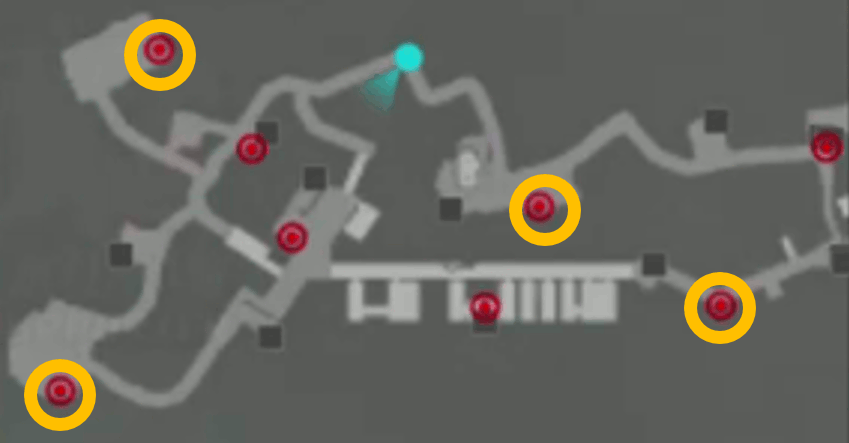

# Bullet Girls 2 New Game 岬守学園 RTA

## タイマー

<dl>
<dt>タイマースタート</dt>
<dd>岬守学園を選択した瞬間</dd>
<dt>タイマーストップ</dt>
<dd>エリア10攻略後、全体マップで操作可能になった瞬間</dd>
</dl>

## タイマースタート～エリア1
△長押しで会話を飛ばす。
余裕があればおっぱいをタッチする。

アイキャッチは〇で飛ばす。

## 1-A

### 出撃
彩、優理奈 ... 最速入力のため

〇連打、〇連打、↑〇

**「出撃しますか？」はデフォルト「いいえ」なので注意**

### 内容
開幕でチュートリアルが始まる。

チュートリアルスキップ～オプション設定

* START, START, ↑, 〇　(オプション選択)
* →↓→↓→　(脱衣演出OFF)
* ↑ x 4 →　(キーコンフィグ2)
* ↑↑　←←↑←←↑→→　(スティック感度を調整。構え時最遅、他最速)
* ×連打　(オプション離脱)

**×を押しすぎてしゃがまないよう注意**

----------------------------------------

XN8-R Lv1 に持ち替え、冷静にヘッドショット(3発)

* 前 -> 左 -> 右 -> 前　の順
* 無駄弾がなけれぱリロード不要

### 備考
ミッション開始演出・リザルトは〇連打で飛ばす

## 1-B

### 出撃 

彩、優理奈 ... 最速入力のため

〇〇↓〇、〇連打、↑〇

### 内容

チュートリアルを閉じつつ走る。

コントローラの持ち方

<dl>
<dt>右中指</dt>
<dd>R1(ダッシュ)</dd>
<dt>右人差し指</dt>
<dd>STARTボタン(チュートリアル閉じる)</dd>
</dl>

コンテナから降りるときは転がった方が多分早い。
**R1を離し、左スティック + ×**

### 注意事項

* 転がる際、R1を押していると「飛び込み」になりロスる
* 慣性が残っているとドラム缶を蹴れない

## 1-C

### 出撃
彩、優理奈 ... 最速入力のため

〇〇↓〇、〇連打、↑〇

### 内容

[1-Bと同様の持ち方](#controller-tutorial)でひた走る。

### 注意事項

* 赤箱の部屋では高確率でバズーカが飛んでくる

## 1-高度任務

### 出撃
* 優理奈 ... ショットガン(と地雷)が強いため
* れみれみ ... 最速入力のため

〇〇↓〇、↓〇連打、↑〇

### 内容

開幕チュートリアルをSTARTで飛ばす。

**開幕の敵は、歩くことで気づかれずに接近できる**

ショットガンでヘッドショットを狙っていく。
ボスもヘッドショットでワンキル可能。
倒れたら地雷を重ねてひん剥くのも良い

## エリア1～2

### 会話パート

△で会話を飛ばす。
**アイキャッチを〇で閉じた瞬間にラップ。**

### 全体マップ
任務追加、購買部入荷メッセージ等を〇連打で飛ばす。

## 2-A
ミッション 2 - A

### 出撃
彩、優理奈　... 最速入力のため

〇連打、〇連打、↑〇

### 内容
走り、ドラム缶を蹴る

## 2-B

### 出撃前
L1連打 (購買部)

----------------------------------------

購買部 

84mm無反動砲を購入する

* ↓〇 (武器選択)
* ↑↑〇 (バズーカ選択)
* 〇↑〇〇 (84mm無反動砲-R Lv1 を選択・購入・入荷メッセージclose)
* ××　(購買部トップに戻る)

**購入操作は受付が遅いのでゆっくりめに**

購買部トップでR1 〇連打 (レンジャー部へ移動、瑠水のセリフを飛ばす)

----------------------------------------

レンジャー部

海凪に84mm無反動砲を装備させる

* ↓ x 5 (海凪選択)
* ↓〇 (9mm拳銃選択)
* ↑↑〇〇 (バズーカ -> 84mm無反動砲-R Lv1 装備)

×連打 (全体マップへ)

### 出撃

彩、優理奈　... 最速入力のため

**〇△△↓〇〇　(難易度をEASYにする)**、
〇連打、
↑〇

### 内容

STUB
(地図掲載予定)

道なりに進み、赤箱を回収する

## 2-C

### 出撃

* 海凪　... 最強アサルトライフル『月煌乃剣』所持
* 優理奈　... リロード速度+20%、最速入力

〇↓〇連打、↑ x 3 〇連打、↑〇

### 内容
STUB
(地図掲載予定)

ヘッドショット

## 2-高度任務

### 出撃

* 海凪　... 最強アサルト
* 陽希　... バズーカ対物+35%、最速入力

〇〇↓〇〇、↓ x 5 〇連打、↑〇

### 内容

STUB
(地図掲載予定)

道なりに殲滅していく

----------------------------------------

テント(物、耐久1200)の処理

* 遠くのもの ... 84mm無反動砲2発
* 近くのもの ... 水着モブもろとも剣豪で1発

詳細

<dl>
<dt>84mm無反動砲-R Lv1</dt>
<dd>基礎攻撃力450 * (100% + 35%) = 607.5</dd>
<dt>剣豪(海凪SOD)</dt>
<dd>基礎攻撃力1500 (対物)</dd>
</dl>

----------------------------------------

ボスは飛び蹴り -> 剣豪 -> ショットガン で撃破する。

## エリア2～3

尋問特訓を飛ばす。

* 開始直前まではSTART連打 (尋問ITEM選択、チュートリアル)
* 開始後は START ↑ 〇

アイキャッチを〇で閉じた瞬間にラップ

## STUB

## 8-1

### 出撃

* 月夜　... 有能スナイパー
* れみれみ　... 強制

〇↓〇連打、↓〇↑〇、↑〇

### 内容

地図持ちの敵の配置は4通り。

2人組のうち、基本的に左の敵が地図を落とす。

爆弾の配置はおそらくランダム。
